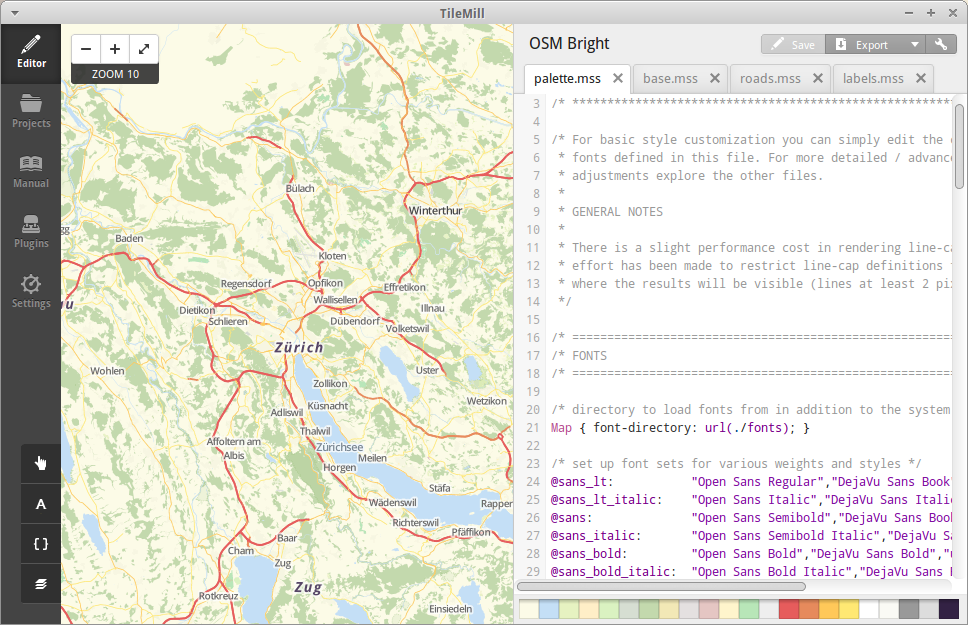

# OSMSwiss-Server



## What is it about?
OSMSwiss-Server is a box to develop, style and create beautiful maps in TileMill2
The example is based on osm-bright provided by: https://github.com/mapbox/osm-bright
As osm-bright is based on imposm2, I adjusted the settings to make it work with imposm3

## Prerequisites
* Linux OS / Windows
* QuadCore, 8GB Ram (otherwise please adjust the Vagrant config file to your needs!)
* Vagrant (https://www.vagrantup.com/)
* TillMill2 (https://www.mapbox.com/tilemill/)

## Installation
### Ubuntu
* Fork / clone / download this repository
* run install script
```bash
./install.sh
```
* wait

### Windows
* Tbd

## Future
* Improve Performance
* MapBox Studio ToolChain

